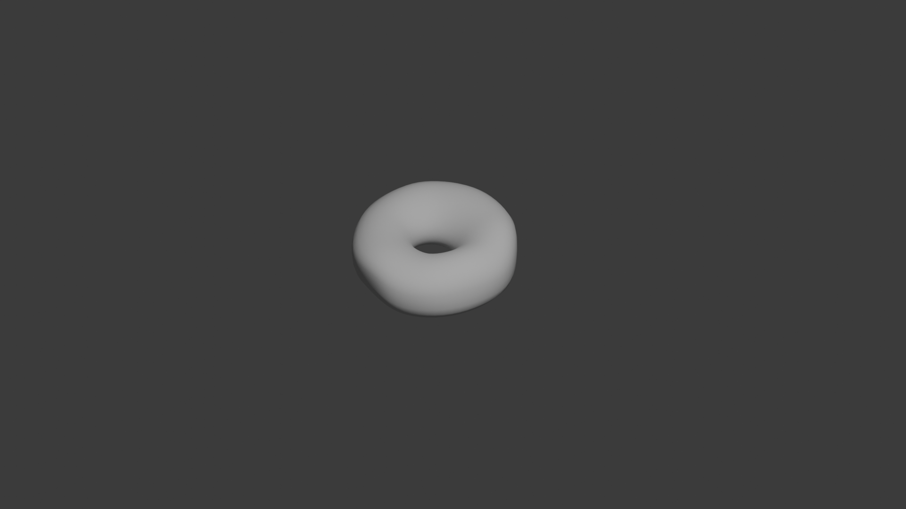
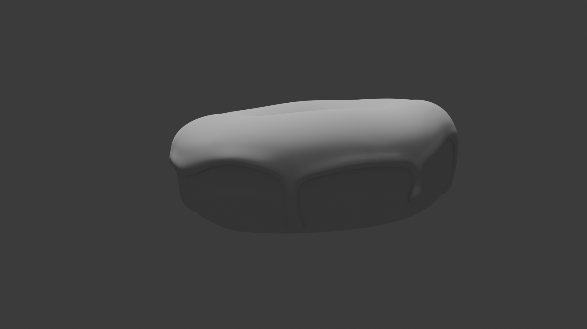
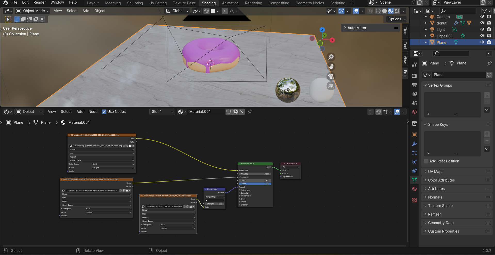
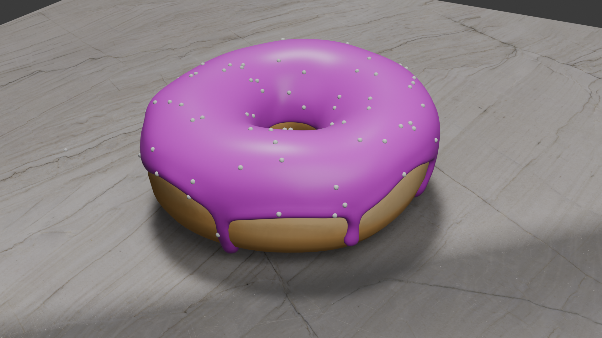
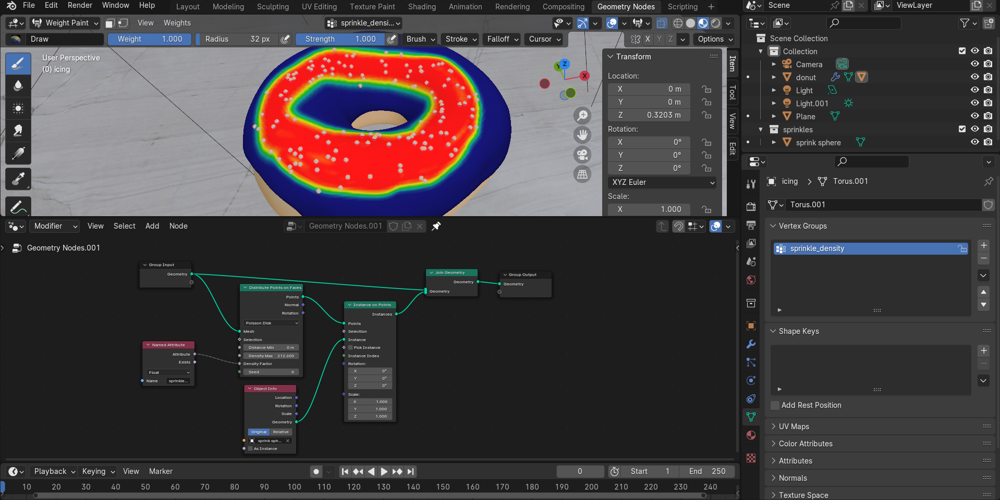
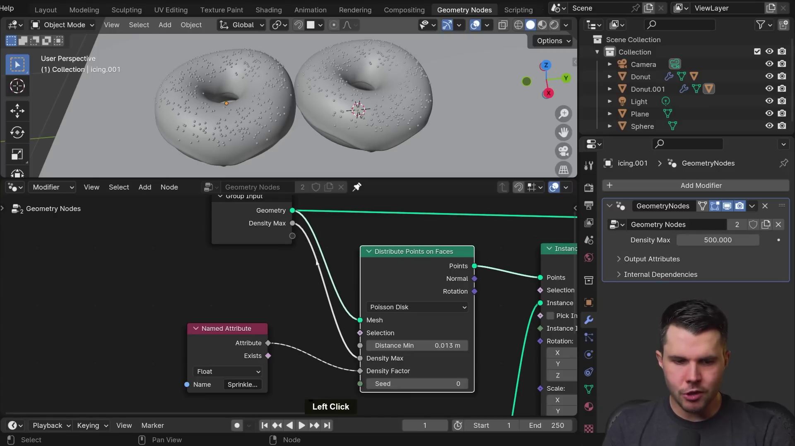
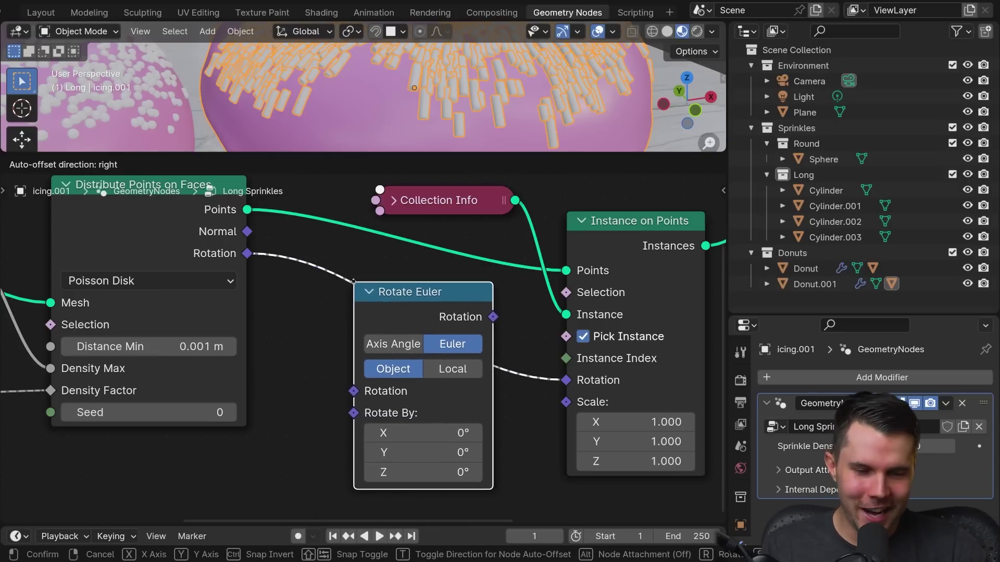
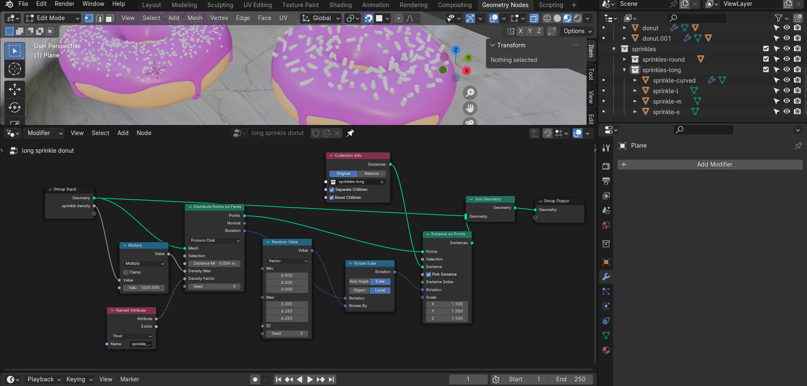

Beginner Blender 4.0 Tutorial
# Blender Guru
F3 - search 

## Part 01: fundamental user interface basics
- 80/20 rule -> 20% of blender features are used 80% of the time
- G -> grab -> then using middle mouse button to drag out in direction it sticks to X , Y or Z axis
- learn interface shortcuts

## Part 02: basic modelling

- learnt about making a donut shape but tweaking it so it doesnt look perfect using proportional editing and circle of influence

## Part 03: Modelling the Icing

- create icing by duplicating donut (SHIFT + D)
- delete bottom half of duplicate
- z-fighting 
- use solidify modifier to give icing thickness (offset should be changed to 1 so normals are facing out)
- thickness 0.025

#### wavey edges for icing
- to hide the shape of icing -> select solidify modifier -> uncheck edit mode (so it doesnt show the shape in edit mode) -> you should be able to see the vertices
- use proportional editing to drag down icing vertices randomly
- BUT... if you drag a vertex down, it doesnt follow the shape of the donut (its separate)
- FIX: snap vertices to donut underneath by turning on snapping: 3d viewport menu -> snapping (magnet icon) -> snap individual elements to "face project"

#### snapping type
1. increment (default which snaps to grid floor)
2. vertex 
3. edge
4. face
...
snap individual elements to 
1. face project
2. face nearest

- if the icing looks like its falling inside the donut its because there is not enough vertices
- FIX: add more geometry -> apply the subdivision surface modifier of icing
- now... pulling down a vertex will stick the icing to the donut BUT... it pulls from the hole side of the icing..BECAUSE circle of influence is so high that it reaches the other side of the donut
- FIX: hide the part of the mesh that we dont want to be influenced by proportional editing tool.
- select the inner vertices (select a vertex then alt + click on a edge) -> then CTRL + -> this increases the selection
- hide it H (hide) / show (ALT + H)
- now we can tweak the icing
- need to fix icing drip edge so its not 90 deg.
- FIX: add sub surface modifier (AFTER the solidify modifier)
- problem: the icing drips down but on the inner side it goes up, where it shouldnt
- FIX: solidify edge data -> add crease to inner part -> 1.0

#### create icing drip
- select 2 vertices -> drag down on z axis -> extend again

## Part 04: Sculpting

PART 1 (0-> 3min)
- fix the mesh icing vs donut where the icing vertices are in the donut (overlaps)
- FIX: we want the icing to wrap the donut
- this lesson we learn about modifier -> deform -> shrink wrap modifier 
- it needs a target -> what are we shrink wrapping (what is the mesh we are shrink wrapping) ie the donut -> eyedropper picker select the donut as target
- modifier stack order matters: 1. shrinkwrap, 2. solidify, 3. subdivision
- it corrects the vertices alignment: donut vs icing
- you can apply the shrinkwrap modifier...

PART 2 (> 3min )
- the accumulation of icing (pooling) at the end of the drip -> because icing is viscous fluid, once it runs out, there is no momentum / gravity from the weight of the icing.
- FIX: create a build up of icing along the icing edges and end of icing drips BUT to do this our icing needs depth -> apply the solidify modifier to fix the shape
- subdivision surface modifier -> update levels viewport to 2 -> apply

#### inflate tool
- sculpting mode: inflate tool (i) 
- change size of brush (F) (then use mouse to pull in/out)
- draw in little circles with the inflate tool

#### mesh filter tool 
- use mask tool (M) to mask off areas that should not be affected
- ALSO with mask -> brush -> select "front faces only" -> this makes sure you dont accidentally mask/paint the inner surfaces
- then you want to inverse the mask you painted so it only allows you to paint on the masked area (white) where the now masked out area is black.
- smooth out the mask -> mask -> smooth mask
- to apply uniform inflation across the whole donut -> mesh filter tool -> and it applies a uniform value using the filter which you have to select (inflate) -> use mouse hold in click and move to less/more effect.
- decrease the strength so its subtle
- turn off mask (ALT + M)

#### smooth tool 
- smooth tool (hold shift) to smooth out places where the mask effect from mesh filter tool inflated the icing too much

#### grab tool
- use grab tool to taper the icing before the end drip

## Part 05: Shading

### TODO: create marble counter-top (plane) to put donut on

#### parent tool
- make the donut parent the icing (icing attached to donut)
- start by selecting the "child" (icing)
- then hold down SHIFT + select parent (donut)
- parent (CTRL + P) / F3 "parent" -> parent keep transform (this retains the positioning)

#### counter-top
- material -> surface -> base color (circle button next to word "base colour") -> image texture
- requires texture: https://www.poliigon.com/ -> search "danali" marble texture -> DOWNLOAD asset
- shader workspace -> nodes -> can add more nodes between nodes
- PBR Shader...connect assets to material node (principle BSDF) (you can drag out from principle BSDF node's - image texture color)

#### principle BSDF base color
- link to new image texture -> QuartziteDenali002_COL_8K_METALNESS.png

#### principle BSDF roughness
- link to new image texture -> QuartziteDenali002_ROUGHNESS_8K_METALNESS.png
- set color space: sRGB -> non-color (need to tell blender not to look at color map but the data values)

#### principle BSDF Normal
- this is the material bumpiness
- link to new image texture -> QuartziteDenali002_NRM_8K_METALNESS.png 
- set color space: sRGB -> non-color (need to tell blender not to look at color map but the data values)
- convert the image data into something principle BSDF can read: between normals texture node and principle bsdf node... add a node: add (SHIFT + A) -> vector -> normal map 
- if you zoom in (CTRL + SPACE) you can see tiny bumps, scratches 

#### assets (unused)
QuartziteDenali002_METALNESS_8K_METALNESS.png
QuartziteDenali002_Sphere.png

### TODO: texture paint the donut
#### Texture paint
- texture painting on the donut because when frying the donut, the part closer to surface away from oil cooked less and when flipped to opposite side, leaves middle part less "fried" as its always floating at the middle.
- texture paint allows you to paint directly onto mesh -> but you need to apply material (not a base color) but choose image texture
- instead of "open" -> select "new" to create new image -> choose image color
- on texture paint workspace -> left panel -> select the new created image from dropdown
- on texture paint workspace -> right panel -> texture paint mode -> can paint on the texture
- after paint -> on the left panel the image needs to be saved.

## Part 06: Geometry Nodes

- geometry nodes workspace
- geometry nodes is actually a modifier
- close geometry nodes spreadsheet (the joint area between the 2 panels -> right click -> join areas -> drag from 3d viewport panel to spreadsheet panel)
- NOTE: with icing selected...
- click new
- group input (left) (original mesh) -> do stuff here.. (add nodes inbetween) -> group output (right)
- the mesh does not change, updates are done on object as a modifier

#### donut sprinkles (3min20)
- TODO: scatter points onto mesh
- add (SHIFT + A) -> points -> distribute points on faces
- instead of replacing icing, leave original icing geometry -> add (SHIFT + A) -> geometry -> join geometry (this should be before group output)
- this adds sprinkles to the icing instead of replacing it
- NOTE: the shape of the connector on the join geometry -> geometry (shape is pill instead of circle) this means it can take multiple inputs
- connect from group input (left) (original mesh) -> into join geometry node
- if you render at this point you wont see anything..because the points in the geometry nodes dont actually exist (only exist in 3d space), if you want them to show in render, you need to tell blender what to render these points as.

#### sprinkle uv sphere
- TODO: add object to be sprinkle
- create UV sphere (12 segments, 8 rings, radius 0.01)
- you need to now reference this uv sphere in geometry node system..
- learnt about pinning the geometry node system of a mesh: pin the icing geometry node system.
- from scene collection (right top)-> drag the uv sphere into geometry node system
- now you need another node to represent and reference the uv sphere: add (SHIFT + A) -> instances -> instances on points
- you want to drop this "instances on points" node between "distribute points on faces" and "join geometry"
- if you render, the sprinkles will actually display
- it appears jagged edges -> select the object in "scene collection" (top-right panel) -> "numberpad's . key" or "`" key will focus on the selection -> right click smooth

#### sprinkle density

- density: if you increase density, the sprinkles overlap...we can fix this..
- FIX: geometry nodes -> "distribute points on faces" -> distribution method -> "poisson disk" (previously "random")
- poisson disk gives extra property you can tweak "distance min" it creates a radius around the uv sphere sprinkle and if it detects a point within this radius it will delete the point

#### weight painting
- PROBLEM: sprinkles are generated even on the negative space (underneath the icing - which will actually be rendered)
- FIX: weight painting - with icing selected go into "weight painting mode"
- mesh becomes blue 
- weight painting allows you to assign a value between 0 and 1 onto the mesh -> so that we can reference this in our geometry nodes as a density mask for our sprinkles
- if you paint (red is 1 blue is 0) and this get added to right panel under object data properties -> vertex group (relabel)
- so from "distribute points on faces" -> density factor -> drag out (search for "named attribute" node)
- in this node (named attribute) -> click on "name" -> and select what you labelled it
- so it only applies sprinkles where we did weight painting and you can go back into weight painting mode to add more sprinkles

#### duplicate object (donut) but still customizable so its unique

- duplicate donut -> you will notice nodes are shared across both objects
- FIX: you can expose props that you want to be customizable in the geometry nodes modifier stack (it dissapears from the node but appears in the modifier as a setting you can adjust) 
- it essentially remove the value from the node and saying its its own separate thing (independent per object)

#### rename exposed node props
- you can rename these exposed values -> geometry nodes workspace -> n (menu) -> geometry -> rename the node property from "density max" to "sprinkle density"

#### realworld sizing
- if you rescale the (donut) to be realworld dimensions (eg 12cm) its about 10 percent of the current size (plane, icing, sprinkles) should also be adjusted..

- apply the scale ("S" to scale down at whole increments hold down CTRL while moving mouse)
- a lot of sprinkles dissapear because "sprinkle density" is actually in relation to the whole scene and when the donut is so much smaller there is less chance of sprinkle "hitting" the icing.
- FIX: 1. adjust sprinkle density higher 2. adjust distance min lower
- you can add a math node (SHIFT + A -> utilities -> math -> math) to recalculate values so they are within a realistic range
 
## Part 07: Geometry Nodes (Long Sprinkles)
- objects are added to 3d cursor -> to move 3d cursor (SHIFT + RIGHT CLICK) 

#### sprinkle
- MODEL: use a cylinder (12 vertices, radius 0.001, depth 0.001) for the sprinkles 
- right click shade smooth
- when objects are tiny, it may dissapear when zooming in, this is because of clipping
- FIX: menu (n) -> view -> clip start: 0.001 m
- rounded ends of cylinder -> select top/bottom faces -> bevel (CTRL + B) and use mouse wheel to create more loop cuts (around x3)
- proportional editing off 
- duplicate (shift + d) and make the medium, long and curved duplicates

#### curved sprinkle 
- the curved sprinkle needs more loop cuts on the body
- BENDING: add modifier -> deform -> simple deform -> bend

#### different types: sprinkle type
1. short
2. medium
3. long
4. curved

#### making a donut with (short,med,long, curved) sprinkles (12min)

- duplicate the donut and icing (SHIFT + D)
- select icing on duplicate donut -> if you go to the modifier stack -> geometry nodes -> it shows how many instances use the node 
- if you click on this number (eg if it was 2), it creates independent instances (label it eg. "long sprinkles" and "round sprinkles")
- reorganize sprinkles -> "round" and "long" group in scene collection
- geometry nodes workspace: 
- NB: ensure long sprinkle icing is the pinned one

#### scattering different types of sprinkles
- select the icing on the duplicate donut -> remove object info "sprinkle sphere info" node (BUT replace by dragging long type sprinkles collection into the space)
- it creates a new "collection info" node -> and connect to "instance on points" node's instance
- the icing shows but its very offset..
- under collection info node.. check separate children
- under collection info node.. check reset children
- at this point, it puts each of the long sprinkle type at each point. FIX: "instance on points" node -> check "pick instance" now it randomly selects one from the collection

#### fix sprinkle instance rotation
- the rotation is wrong (they all point upwards)
- FIX: rotate the sprinkle assets (spares) so they lay horizontally AND apply the rotation
- the sprinkles are all aligned at same angle, to create a random rotation, between "distribution points on faces" node and "instance on points" node
- connection rotation between nodes "distribution points on faces" node and "instance on points" they align with the donut but we want a random rotation
- FIX: add rotate euler: add (SHIFT + A) -> utilities -> rotation -> rotate euler -> icing is arranged in circle flow 

#### rotate euler
- set method used to describe rotation: "euler"
- set base orientation for rotation to "local"

#### random value node
- FIX: drag out from "rotate by" on the "rotate euler" node -> add "random value" node
- min/max values are for vector x,y,z
- tweak max-z (value is in radians) -> to make 360 deg (2 x pie) = "tau" = 6.283 

#### sprinkle tweaks
- update scale on "instance on points" node to 1.5
- set "distribute points on faces" -> distance min: 0.006m

## Part 08: Rendering!
## Part 09: Layout
## Part 10: Lighting
## Part 11: Compositing
## Part 12: Animation
## Part 13: Rendering
## Part 14: Finale!