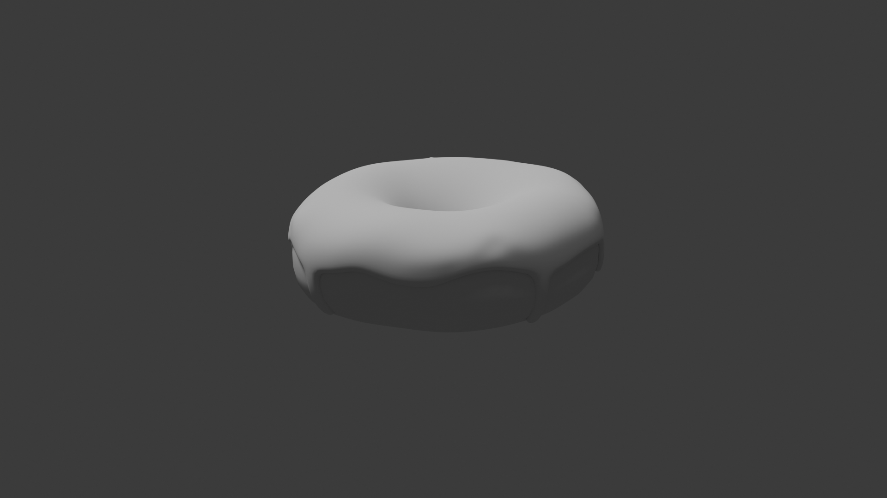

# Beginner Blender 4.0 Tutorial

- F3 - search 
- blender preferences -> interface -> status bar -> show video memory / show system memory etc 

## Part 01: fundamental user interface basics
- 80/20 rule -> 20% of blender features are used 80% of the time
- G -> grab -> then using middle mouse button to drag out in direction it sticks to X , Y or Z axis
- learn interface shortcuts

## Part 02: basic modelling

- learnt about making a donut shape but tweaking it so it doesnt look perfect using proportional editing and circle of influence

## Part 03: Modelling the Icing

- create icing by duplicating donut (SHIFT + D)
- delete bottom half of duplicate
- z-fighting 
- use solidify modifier to give icing thickness (offset should be changed to 1 so normals are facing out)
- thickness 0.025

#### wavey edges for icing
- to hide the shape of icing -> select solidify modifier -> uncheck edit mode (so it doesnt show the shape in edit mode) -> you should be able to see the vertices
- use proportional editing to drag down icing vertices randomly
- BUT... if you drag a vertex down, it doesnt follow the shape of the donut (its separate)
- FIX: snap vertices to donut underneath by turning on snapping: 3d viewport menu -> snapping (magnet icon) -> snap individual elements to "face project"

#### snapping type
1. increment (default which snaps to grid floor)
2. vertex 
3. edge
4. face
...
snap individual elements to 
1. face project
2. face nearest

- if the icing looks like its falling inside the donut its because there is not enough vertices
- FIX: add more geometry -> apply the subdivision surface modifier of icing
- now... pulling down a vertex will stick the icing to the donut BUT... it pulls from the hole side of the icing..BECAUSE circle of influence is so high that it reaches the other side of the donut
- FIX: hide the part of the mesh that we dont want to be influenced by proportional editing tool.
- select the inner vertices (select a vertex then alt + click on a edge) -> then CTRL + -> this increases the selection
- hide it H (hide) / show (ALT + H)
- now we can tweak the icing
- need to fix icing drip edge so its not 90 deg.
- FIX: add sub surface modifier (AFTER the solidify modifier)
- problem: the icing drips down but on the inner side it goes up, where it shouldnt
- FIX: solidify edge data -> add crease to inner part -> 1.0

#### create icing drip
- select 2 vertices -> drag down on z axis -> extend again

## Part 04: Sculpting

PART 1 (0-> 3min)
- fix the mesh icing vs donut where the icing vertices are in the donut (overlaps)
- FIX: we want the icing to wrap the donut
- this lesson we learn about modifier -> deform -> shrink wrap modifier 
- it needs a target -> what are we shrink wrapping (what is the mesh we are shrink wrapping) ie the donut -> eyedropper picker select the donut as target
- modifier stack order matters: 1. shrinkwrap, 2. solidify, 3. subdivision
- it corrects the vertices alignment: donut vs icing
- you can apply the shrinkwrap modifier...

PART 2 (> 3min )
- the accumulation of icing (pooling) at the end of the drip -> because icing is viscous fluid, once it runs out, there is no momentum / gravity from the weight of the icing.
- FIX: create a build up of icing along the icing edges and end of icing drips BUT to do this our icing needs depth -> apply the solidify modifier to fix the shape
- subdivision surface modifier -> update levels viewport to 2 -> apply

#### inflate tool
- sculpting mode: inflate tool (i) 
- change size of brush (F) (then use mouse to pull in/out)
- draw in little circles with the inflate tool

#### mesh filter tool 
- use mask tool (M) to mask off areas that should not be affected
- ALSO with mask -> brush -> select "front faces only" -> this makes sure you dont accidentally mask/paint the inner surfaces
- then you want to inverse the mask you painted so it only allows you to paint on the masked area (white) where the now masked out area is black.
- smooth out the mask -> mask -> smooth mask
- to apply uniform inflation across the whole donut -> mesh filter tool -> and it applies a uniform value using the filter which you have to select (inflate) -> use mouse hold in click and move to less/more effect.
- decrease the strength so its subtle
- turn off mask (ALT + M)

#### smooth tool 
- smooth tool (hold shift) to smooth out places where the mask effect from mesh filter tool inflated the icing too much

#### grab tool
- use grab tool to taper the icing before the end drip

## Part 05: Shading

### TODO: create marble counter-top (plane) to put donut on

#### parent tool
- make the donut parent the icing (icing attached to donut)
- start by selecting the "child" (icing)
- then hold down SHIFT + select parent (donut)
- parent (CTRL + P) / F3 "parent" -> parent keep transform (this retains the positioning)

#### counter-top
- material -> surface -> base color (circle button next to word "base colour") -> image texture
- requires texture: https://www.poliigon.com/ -> search "danali" marble texture -> DOWNLOAD asset
- shader workspace -> nodes -> can add more nodes between nodes
- PBR Shader...connect assets to material node (principle BSDF) (you can drag out from principle BSDF node's - image texture color)

#### principle BSDF base color
- link to new image texture -> QuartziteDenali002_COL_8K_METALNESS.png

#### principle BSDF roughness
- link to new image texture -> QuartziteDenali002_ROUGHNESS_8K_METALNESS.png
- set color space: sRGB -> non-color (need to tell blender not to look at color map but the data values)

#### principle BSDF Normal
- this is the material bumpiness
- link to new image texture -> QuartziteDenali002_NRM_8K_METALNESS.png 
- set color space: sRGB -> non-color (need to tell blender not to look at color map but the data values)
- convert the image data into something principle BSDF can read: between normals texture node and principle bsdf node... add a node: add (SHIFT + A) -> vector -> normal map 
- if you zoom in (CTRL + SPACE) you can see tiny bumps, scratches 

#### assets (unused)
QuartziteDenali002_METALNESS_8K_METALNESS.png
QuartziteDenali002_Sphere.png

### TODO: texture paint the donut
#### Texture paint
- texture painting on the donut because when frying the donut, the part closer to surface away from oil cooked less and when flipped to opposite side, leaves middle part less "fried" as its always floating at the middle.
- texture paint allows you to paint directly onto mesh -> but you need to apply material (not a base color) but choose image texture
- instead of "open" -> select "new" to create new image -> choose image color
- on texture paint workspace -> left panel -> select the new created image from dropdown
- on texture paint workspace -> right panel -> texture paint mode -> can paint on the texture
- after paint -> on the left panel the image needs to be saved.

## Part 06: Geometry Nodes

- geometry nodes workspace
- geometry nodes is actually a modifier
- close geometry nodes spreadsheet (the joint area between the 2 panels -> right click -> join areas -> drag from 3d viewport panel to spreadsheet panel)
- NOTE: with icing selected...
- click new
- group input (left) (original mesh) -> do stuff here.. (add nodes inbetween) -> group output (right)
- the mesh does not change, updates are done on object as a modifier

#### donut sprinkles (3min20)
- TODO: scatter points onto mesh
- add (SHIFT + A) -> points -> distribute points on faces
- instead of replacing icing, leave original icing geometry -> add (SHIFT + A) -> geometry -> join geometry (this should be before group output)
- this adds sprinkles to the icing instead of replacing it
- NOTE: the shape of the connector on the join geometry -> geometry (shape is pill instead of circle) this means it can take multiple inputs
- connect from group input (left) (original mesh) -> into join geometry node
- if you render at this point you wont see anything..because the points in the geometry nodes dont actually exist (only exist in 3d space), if you want them to show in render, you need to tell blender what to render these points as.

#### sprinkle uv sphere
- TODO: add object to be sprinkle
- create UV sphere (12 segments, 8 rings, radius 0.01)
- you need to now reference this uv sphere in geometry node system..
- learnt about pinning the geometry node system of a mesh: pin the icing geometry node system.
- from scene collection (right top)-> drag the uv sphere into geometry node system
- now you need another node to represent and reference the uv sphere: add (SHIFT + A) -> instances -> instances on points
- you want to drop this "instances on points" node between "distribute points on faces" and "join geometry"
- if you render, the sprinkles will actually display
- it appears jagged edges -> select the object in "scene collection" (top-right panel) -> "numberpad's . key" or "`" key will focus on the selection -> right click smooth

#### sprinkle density

- density: if you increase density, the sprinkles overlap...we can fix this..
- FIX: geometry nodes -> "distribute points on faces" -> distribution method -> "poisson disk" (previously "random")
- poisson disk gives extra property you can tweak "distance min" it creates a radius around the uv sphere sprinkle and if it detects a point within this radius it will delete the point

#### weight painting
- PROBLEM: sprinkles are generated even on the negative space (underneath the icing - which will actually be rendered)
- FIX: weight painting - with icing selected go into "weight painting mode"
- mesh becomes blue 
- weight painting allows you to assign a value between 0 and 1 onto the mesh -> so that we can reference this in our geometry nodes as a density mask for our sprinkles
- if you paint (red is 1 blue is 0) and this get added to right panel under object data properties -> vertex group (relabel)
- so from "distribute points on faces" -> density factor -> drag out (search for "named attribute" node)
- in this node (named attribute) -> click on "name" -> and select what you labelled it
- so it only applies sprinkles where we did weight painting and you can go back into weight painting mode to add more sprinkles

#### duplicate object (donut) but still customizable so its unique

- duplicate donut -> you will notice nodes are shared across both objects
- FIX: you can expose props that you want to be customizable in the geometry nodes modifier stack (it dissapears from the node but appears in the modifier as a setting you can adjust) 
- it essentially remove the value from the node and saying its its own separate thing (independent per object)

#### rename exposed node props
- you can rename these exposed values -> geometry nodes workspace -> n (menu) -> geometry -> rename the node property from "density max" to "sprinkle density"

#### realworld sizing
- if you rescale the (donut) to be realworld dimensions (eg 12cm) its about 10 percent of the current size (plane, icing, sprinkles) should also be adjusted..

- apply the scale ("S" to scale down at whole increments hold down CTRL while moving mouse)
- a lot of sprinkles dissapear because "sprinkle density" is actually in relation to the whole scene and when the donut is so much smaller there is less chance of sprinkle "hitting" the icing.
- FIX: 1. adjust sprinkle density higher 2. adjust distance min lower
- you can add a math node (SHIFT + A -> utilities -> math -> math) to recalculate values so they are within a realistic range
 
## Part 07: Geometry Nodes (Long Sprinkles)
- objects are added to 3d cursor -> to move 3d cursor (SHIFT + RIGHT CLICK) 

#### sprinkle
- MODEL: use a cylinder (12 vertices, radius 0.001, depth 0.001) for the sprinkles 
- right click shade smooth
- when objects are tiny, it may dissapear when zooming in, this is because of clipping
- FIX: menu (n) -> view -> clip start: 0.001 m
- rounded ends of cylinder -> select top/bottom faces -> bevel (CTRL + B) and use mouse wheel to create more loop cuts (around x3)
- proportional editing off 
- duplicate (shift + d) and make the medium, long and curved duplicates

#### curved sprinkle 
- the curved sprinkle needs more loop cuts on the body
- BENDING: add modifier -> deform -> simple deform -> bend

#### different types: sprinkle type
1. short
2. medium
3. long
4. curved

#### making a donut with (short,med,long, curved) sprinkles (12min)

- duplicate the donut and icing (SHIFT + D)
- select icing on duplicate donut -> if you go to the modifier stack -> geometry nodes -> it shows how many instances use the node 
- if you click on this number (eg if it was 2), it creates independent instances (label it eg. "long sprinkles" and "round sprinkles")
- reorganize sprinkles -> "round" and "long" group in scene collection
- geometry nodes workspace: 
- NB: ensure long sprinkle icing is the pinned one

#### scattering different types of sprinkles
- select the icing on the duplicate donut -> remove object info "sprinkle sphere info" node (BUT replace by dragging long type sprinkles collection into the space)
- it creates a new "collection info" node -> and connect to "instance on points" node's instance
- the icing shows but its very offset..
- under collection info node.. check separate children
- under collection info node.. check reset children
- at this point, it puts each of the long sprinkle type at each point. FIX: "instance on points" node -> check "pick instance" now it randomly selects one from the collection

#### fix sprinkle instance rotation
- the rotation is wrong (they all point upwards)
- FIX: rotate the sprinkle assets (spares) so they lay horizontally AND apply the rotation
- the sprinkles are all aligned at same angle, to create a random rotation, between "distribution points on faces" node and "instance on points" node
- connection rotation between nodes "distribution points on faces" node and "instance on points" they align with the donut but we want a random rotation
- FIX: add rotate euler: add (SHIFT + A) -> utilities -> rotation -> rotate euler -> icing is arranged in circle flow 

#### rotate euler
- set method used to describe rotation: "euler"
- set base orientation for rotation to "local"

#### random value node
- FIX: drag out from "rotate by" on the "rotate euler" node -> add "random value" node
- min/max values are for vector x,y,z
- tweak max-z (value is in radians) -> to make 360 deg (2 x pie) = "tau" = 6.283 

#### sprinkle tweaks
- update scale on "instance on points" node to 1.5
- set "distribute points on faces" -> distance min: 0.006m

## Part 08: Rendering
- this part is about giving the sprinkles color
- DO NOT color the asset sprinkles manually by giving the asset instance a material color 
- WHY NOT? color becomes locked to that sprinkle -> this ends up giving each (eg. all curved sprinkles) the same color
- WHY NOT? color distribution is same

#### linking materials (to apply same material accross many objects by linking)
- create a material and apply it to single sprinkle asset
- then shift + select all other sprinkles and again the sprinkle with the material (so it becomes the active object) lighter orange than the others
- then link (CTRL + L) -> link materials

#### object info node / color ramp node

- select sprinkle -> SHADING viewport -> add (SHIFT + A) -> input -> object info node
- object info node has a "random" -> connect it to Principle BSDF's "base color" -> this assigns random value on scale between 0 and 1 and assigns it as colors
- now add a color ramp node: add (SHIFT + A) -> converter -> color ramp
- you can set colors (but its on a gradient) which makes the sprinkles colors have gradient
- FIX: update interpolation on color ramp to "constant" -> now if you drag the colors on the scale it becomes a ratio of occurance of sprinkles on the donut
- FIX: use HSV -> set saturation lower (less attention grabbing: 0.8)

#### making metalic sprinkles

- playing with principle BSDF metallic value (set to 1) makes all sprinkles metalic
- FIX: order the colors so the metallic colors are on one side (easier) 
- FIX: duplicate color ramp + retain connection (CTRL + SHIFT + D) 
- connect new color ramp duplicate to metalic on principle BSDF -> set non metal colors to RGB black and metals to white (because its a scale black or white you only need 2 colors on the color bar) 
- FIX: to make sprinkle more metalic reduce roughness all the way down

#### making normal color sprinkles less shiny (finishes at 10min22sec)
- duplicate the metalic sprinkles color ramp (CTRL + SHIFT + D)
- FIX: hook up the now duplicate metalic color ramp the color to roughness on principle BSDF
- the blacker (lower roughness) and whiter (more rough) now decide the roughness of metalic and non-metallics (should be opposite to metalic color ramp color)
- render with cycles render mode to see metalic colors

#### RENDERING (10min22sec)

#### fly mode
- turn on fly mode: scene collection outliner (top-right panel): with camera selected -> fly mode (SHIFT + `) 
- alternatively: view -> navigation -> fly navigation
- when fly mode is on, moving the mouse will move where camera looks... 
- use W,S,A,D, use E (up) and Q (down) to control camera panning and mouse wheel controls speed of effect
- render with eevee (fast real-time rasterized render engine -> but not accurate) 
- render with cycles (ray-trace / path-trace / offline render engine -> slower but better renders)

#### eevee
- you can make eevee render look better:
- shadows -> cube size -> 4096px

#### cycles
- proper shadows (eg. sprinkles) 
- bounce lighting
- you can use gpu to render: edit -> preferences -> system -> cycles render devices
- render -> scene -> device -> GPU
- denoiser: sampling -> denoise
- denoiser: render -> denoise
- reset position of light -> select light -> reset (ALT + G)

#### material with subsurface scatter (flesh/food)

- subsurface scatter is when light shines though objects
- FIX: select icing / sprinkle asset -> materials -> subsurface -> weight -> 1.0
- FIX: select icing / sprinkle asset -> materials -> subsurface -> subsurface radius represents (x,y,z) and/or (RGB) (by default set to values for skin) -> reset to 1.0 for all radius
- FIX: select icing / sprinkle asset -> materials -> subsurface -> subsurface scale is thickness -> 0.005m
- subsurface scattering automatically cancelled for metals

---

## Part 09: Layout

- TASK: make a plate
- suggestion: start with a circle instead of cylinder (reason is cylinder theres a top face you dont need and the normals have to be flipped for shape without top face) 
- suggestion: use split screen with one as Image editor -> image -> open
- create circle
- radius 0.12m / vertices 100 (high poly because of bevels on plate) 
- select vertices -> extrude (e) on z -> then scale out (s)
- extrude (e) -> scale (s) scale immediately after hitting extrude
- select all initial vertices of circle and add face (f)
- plate bevel: in edge mode -> select the 3 edges (alt + mouse click on edges + shift click on other edges) ->  add bevel for plate (3 curves of plate -> select edge) -> ctrl + B -> use mouse wheel for smoothing bevel
- thickness: add modifier -> solidify
- top plate edge needs the solidify modifier to be applied (object mode) -> apply solidify modifier
- apply bevel to 2 top bevels 
- for the overlap of the bevel...clamp overlap (c)-> turns on clamping (see bottom of viewport for shortcuts available): bevels to point where edges touch then stops
- right-click -> shade smooth 
- stack donuts (shift + D) on top each other (use slight rotation) 
- rotate on z -> (double click z -> to rotate on donuts own local z-axis)

#### random donut icing
- could use color ramp node...
- tutorial method -> create different materials for the different colors of the icing
- create another color: select the donut icing (currently under material shows number of instances with same color) -> click to make its own instance

#### plate details
- low roughness to give it a shine (0.01)
- subsurface: weight 1, radius (x,y,z): 1, scale: 0.001m

#### merge vertices / vertices cleanup
- vertices sharing same space will cause artifacting (cause by extrusions -> edges merge but sharing same space)
- FIX: edit mode -> select all (a) -> merge (m) -> by distance -> bottom of screen (shows how many vertices cleaned up) 

#### adjusting camera
- select camera -> CAMERA object data properties tab -> view port display -> size: 0.1

#### SHORTCUTS 
z - switch between view modes  
m - select all in edit mode -> merge vertices (m) -> by distance  
SHIFT ` - fly view mode  

---

## Part 10: Lighting
- currently the scene looks like you're outside picnicking under a tree because the light is coming from all directions
- we want to give it the effect that it feels like you're inside a kitchen where sunlight is coming in from the windows
- replace light: currently light (sun) 
- move donuts/plate to edge of counter away from backsplash (create depth of field later...)

#### achieving natural skylight
- scene -> world tab (can remove background)
- using natural sky light (creates exact view of the sky)
- remove light in scene
- scene collection selected -> world propertaies -> surface -> color (DOT) -> sky texture 
- tweakable: sun size: 2.44 (real sun size in relation to the earth), sun rotation, sun elevation

#### creating a skybox / snapping mode 
- blender file created so can reuse the skybox
- creating a skybox (geometry) which contains / restricts the light by adding a cube to scene
- wireframe mode: line up the corners of the cube with the backsplash/counter
- camera sits inside the skybox
- remove redundant faces of skybox (back which cooincides with backsplash, floor which cooincides with counter)
- INSET a side of the skybox for the window and DELETE the inset face
- NOTE: the light from the open side of the skybox is causing the face its shining on the reflect/refract the color from the skybox... 
- FIX: paint wall black to stop bounce light (material surface -> change from principled BSDF to Diffuse BSDF)
- adjust the hole size on the face letting in light
- scene -> world -> surface -> strength: this is the strength of the lighting on the world (sky texture)
- scene -> world -> surface -> adjust sun intensity instead: 0.5 then play with color 
- then you can play with render properties tab -> color management -> exposure: -2

#### snapping for alignment
- in edit mode
- Grab object in face mode (G) -> snapping mode (B) -> now you have to choose the origin of the object that you are moving that you want to be the snapping point... -> then select the point where it should snap to
    - circle (snap to face)
    - crosshair (snap to edge)
    - triangle (snap to middlepoint of edge)
    - square (snap to vertice)

#### SHORTCUTS 
B - snapping mode

#### "sky texture" via shading viewport
- the above method can be also achieve using shading viewport 
- shader type -> world
- add sky texture node -> link sky texture node to background node
- preview in viewport shading mode: render preview

#### importing other models
- file -> append -> object 

---

## Part 11: Compositing

#### fixing the scene lighting
- TODO: add light (area) on right of plate of donuts -> scale down and cast light (point) towards plate (scale: larger more spread / less intense) size: 0.19m, power: 600 mW (less that 1w)
- TODO: fix lighting refraction from black wall (right wall which is where sunlight shines onto from left) -> due to the light bounce off the wall its difficult to control light
- FIX: replace the material color value (click on color select box) -> value: 0
- FIX: fixed objects on stage orientation, the skybox opening is on left, the camera is facing back (from front view), the backsplash is visible in front-view pointed at by camera
- FIX: scene -> world properties tab -> sun intensity: 0.5, sun rotation: -89deg 

#### compositing (3min21sec)

- compositor: add effects to final render
- TODO: add glare to simulate camera
- compositor viewport (left node (original) -> right node (composite node: result output))
- click "use nodes" 
- preview available once you have atleast rendered the scene
- reduce render max samples: render properties tab -> max samples (from 4096) -> 100
- TO SEE EFFECTS OF just the node (CTRL + SHIFT + left click) (note if the copositing node tree "rewires", just select a node further down the join tree and CTRL + SHIFT + left click on that to preview the final result)

#### preview effects in realtime
- split viewport -> select 3d viewport 
- rendered mode (3d viewport -> top right menu dropdown) -> compositor -> always

#### disable compositor
- only see original render without compositing effect: output properties tab -> post processing -> compositing -> off 

#### add viewer node
- CTRL + SHIFT + Left click on "render layer node" 
- blender adds preview window and shows background render (now there is "viewer node" AND "composite node")
- note if you drag stuff on viewer node its wont be in final result unless added to composite node

#### SHORTCUTS
- move background render around: ALT + MIDDLE MOUSE
- select viewer node -> drag the background sample image corner  OR resize backround: shrink (v) / zoom (ALT+V)
- move nodes: MIDDLE MOUSE BUTON 

#### color management
- AgX is more realist looking renders than "filmic"
- render properties -> color management -> view transform -> agx -> look -> medium high contrast OR high contrast
- exposure -1.622

#### adding glare effect (sparkle) (9min 13sec)
- add glare: shift + a -> glare and place ontop of the link between render layers and view node
- streaks: 16 (the amount of lines on the glare)
- threshold: how much of image is affected (high means only the bright things on scene is affected): 6.6
- mix (sometimes its useful to see the effect on its own (value:1)): range between -1 (original render) and 1 (just the effect itself): -0.9 

#### blending effects (glare / fog glow)
- GLARE: mix: 1, threshold: 13.5, streak: 16
- FOG-GLOW (duplicate the GLARE node: CTRL + SHIFT + D (duplicate but keep connected)) -> glare type: fog glow
    - quality: HIGH, mix: 1, threshold:13.5, size:9

##### add color mix
- add color -> mix -> mix color node (has 2 inputs for "image") -> change from "mix" to "add"
- set the output "image" to viewer node input
- Factor -> defines strength of the bottom input (image)
- so if you're blending and want to control it, put it in bottom input
- our bottom is the glare node and we want to set low FAC value to dampen the effect of streaks 0.01
- to blend our effect with our original render, duplicate the "mix color node" and drag onto composite link

#### ADD lense distortion filter node (fisheye mode)
- add (shift + a) -> transform -> lense distortion 
- select "fit" 
- amount: 0.01

---

## Part 12: Animation
- camera move from above to side using key-frame animation
- instead of moving the camera...

TASK: you parent an empty for the camera at the center of the scene and then just rotate the empty
- move 3d cursor (hold SHIFT + rightclick) at center of scene 
- add an empty (SHIFT + A -> empty) -> set display as "sphere" and scale it down
- then set the empty as the parent for the camera: select camera...
- SHIFT + select the empty -> set parent to (CTRL + P) -> Object (keep transform)
- RESULT: if you rotate the empty, the camera moves with it

#### animation viewport

- NOTE: we are animating the empty
- open dope sheet viewport

##### 1. END POSITION
- start by adding keyframe for end result of scene -> camera mode -> goto the keyframe eg 160th frame
- select empty -> instert keyframe (press i while over 3d viewport) -> rotation

##### 2. START POSITION
- go to first frame (SHIFT + LEFT ARROW)
- set scene for start position: rotate (R) on X-axis
- add keyframe (i) 
- you can delete the object transform rows that arent relevant: eg. y,z (we rotated on x)

#### animation tweaks with "Graph editor"
##### SHORTCUTS
- Pan graph editor (middle mouse button)
- autofit graph in window (home key OR CTRL + hold down middle mouse button)

- open graph editor panel
- below shows the curve for a quick start but smooth ease to end frame

- graph-editor viewport -> select a dot -> grab curve handles -> use rotate (R) to change the angle of the curve
- jumping to keyframes using up/down arrow keys
- goto end frame and i (insert keyframe menu) -> scale

#### zooming via scale -> adding intial camera "pull out/away" / adding end pull-out (10min29sec)
- goto end frame 160 -> select pivot point (the empty) and to create the pull out/away effect -> scale the empty 
- create a keyframe for scale: on frame 160 -> insert (i) -> scale
- now goto frame 1 -> insert (i) -> scale
- graph editor (when you have scale AND rotation on same graph) -> click normalize, it will plot both graphs at same relative scale together on the graph

## Part 13: Rendering
- use cycles 
- turn on denoise 
- low sample count will affect quality (300 bare minium -> 500 quality ok -> 1000 sample count clean)
- render animation -> framerate: 30
- Fileformat: ffmpeg -> render to video (if it crashes you loose all render progress)
- use Fileformat: png -> sequence (number of images = length of animation keyframes)
- output folder to render the multiple images to
- UPDATE: donut bread -> add subsurface scattering -> weight: 1, radius X,Y,Z: 1, scale: 0.01m

#### resuming a render
- if your animation is 120 keyframes and each frame takes 1 min to render... it will take 2hrs to complete the render.
- if you are saving rendered progress to image sequence -> to continue at keyframe -> render properties tab -> uncheck "image sequence overwrite"
- NOTE: it continues rendering at after the last rendered image in the sequence

#### CHECKLIST BEFORE RENDER
- normals -> normals should be blue: viewport overlays (top middle menu) -> face orientation
- if you see red normals... flip it: edit mode -> select all that is affects -> flip normals (SHIFT + N)
- depth of field -> camera tab -> select depth of field checkbox -> select focus object
- depth of field -> camera tab -> lower the fstop -> lower amount of things in focus (6-8 ideal)
- render tab -> enable motion blur (check/enable)

## Part 14: Finale - 2nd run of render from video editing workspace!

[   click here](https://youtu.be/Pgjk1E38f_g)

- TODO: turning image sequence into a video
- NOTE: INSTEAD of turning off things (see below) start a new window -> video editing workspace and reselect 
- we set an output folder to render to -> depending on number of key-frames...that will be the number of image renders
- using blender to render video sequence: video editing -> video editing
- in the sequence (bottom panel)-> add image sequence (SHIFT + A -> image sequence) -> select all (a) -> add image strip
- you adjust the framerate (30 fps)
- pause on end frame: click on strip edge (end) -> it should highlight white -> grab (g) -> move to frame eg 250 
- add fadeout -> shift + A -> color
- a block should be added to the sequence on its own layer -> Select it -> shift + a -> fade -> fade-in
- set output file -> ffmpeg 
- encoding -> container (mpeg 4), output quality (perceptually lossless)
- render -> render animation
- NOTE: it knows to render using images (image sequence) because render output tab -> postprocessing -> sequencer is selected / and so it chooses that over rendering the camera
- NOTE: when you are rendering the image sequence in video editor from images, you should turn off render properties -> color management: use default (because its "baked in" to the rendered images)
- NOTE: turn off compositi  ng
- NOTE: THE SECOND TIME YOU RUN RENDER (*from image sequence)-> the output should be mp4
- NOTE: OUTPUT -> post processing -> sequencer needs to be selected -> RENDER

## Reference
- [Blender Guru](https://www.youtube.com/playlist?list=PLjEaoINr3zgEPv5y--4MKpciLaoQYZB1Z)